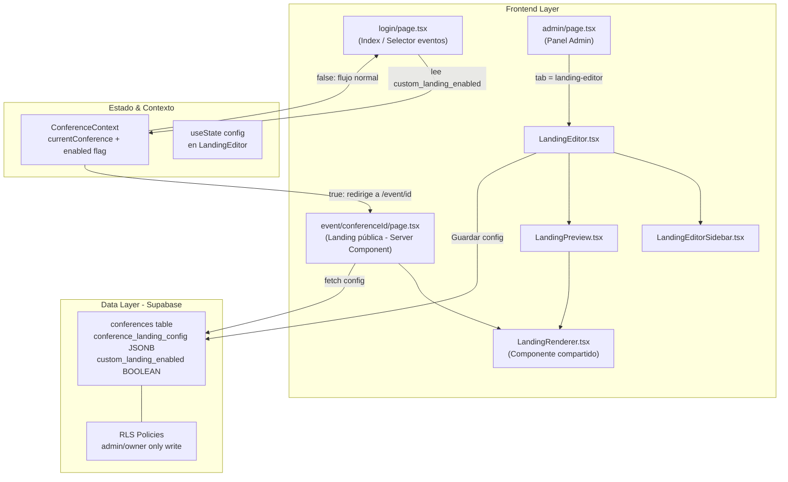
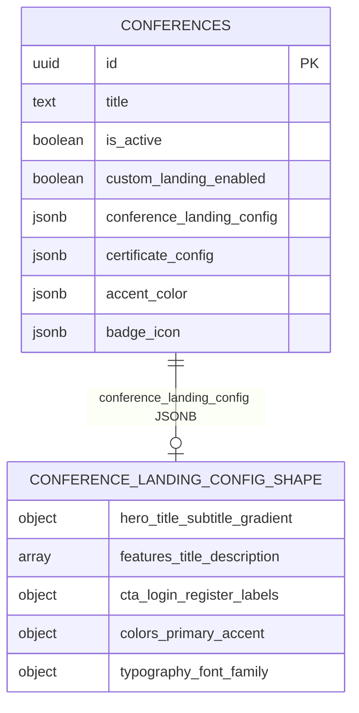
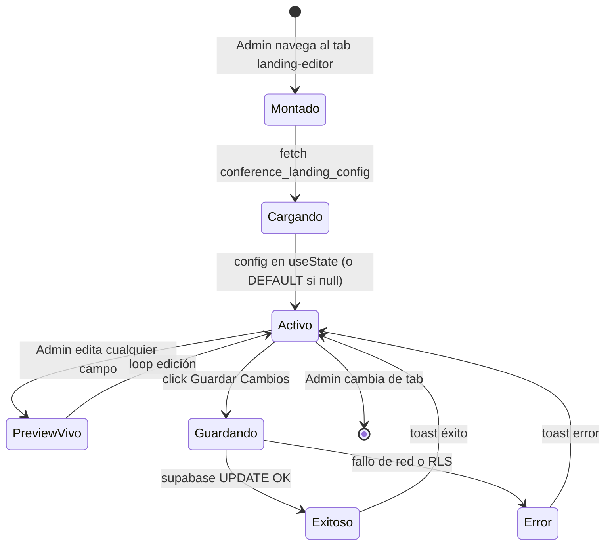

# Editor de Landing Page de Evento


Los administradores y owners de eventos globales (ej. Semana del Diseño) podrán activar un **Editor de Landing Page** para personalizar completamente la pantalla de bienvenida/registro de su conferencia. Por defecto la plataforma sigue mostrando la pantalla `login/page.tsx` actual. Cuando la opción está activa, quienes lleguen a esa conferencia ven la landing personalizada en lugar del selector de eventos, manteniendo siempre sutilmente los elementos institucionales bloqueados ("Plataforma Cherry K2" y "Creado por: Prof. Adrián Torres").

---

## 1. Requirements & Constraints

- **REQ-001**: Solo usuarios con `role = 'admin'` u `role = 'owner'` pueden acceder y utilizar el Editor de Landing Page.
- **REQ-002**: El Editor debe estar accesible desde el sidebar del panel admin (`/admin`) en la sección "Herramientas de Administrador".
- **REQ-003**: La opción de Landing Page personalizada debe estar **desactivada por defecto**. El admin/owner la activa manualmente por conferencia.
- **REQ-004**: Cuando el editor está activo para una conferencia, los visitantes que seleccionen ese evento en el index NO verán el botón "Cambiar de evento"; en su lugar, son enrutados directamente a la landing personalizada.
- **REQ-005**: El editor debe mostrar un **preview en tiempo real** al lado de los controles de edición (layout: panel lateral izquierdo de opciones + panel derecho de preview).
- **REQ-006**: Los elementos institucionales **"Plataforma Cherry K2"** y **"Creado por: Prof. Adrián Torres"** deben aparecer siempre en la landing personalizada de forma sutil (p.ej. `opacity-40`, `text-xs`) y NO ser editables ni ocultables por el admin.
- **REQ-007**: La configuración de la landing debe persistirse por conferencia en Supabase (`conference_landing_config` JSONB en la tabla `conferences`).
- **REQ-008**: El nombre de la herramienta en el sidebar será **"Editor de Landing"** (conciso e intuitivo).
- **SEC-001**: Las rutas de guardar/actualizar la configuración de landing deben verificar el rol en server-side (Supabase RLS + middleware).
- **SEC-002**: Los campos bloqueados (`locked_elements`: branding institucional) NO deben incluirse en el payload editable; son generados siempre por el componente de renderizado.
- **CON-001**: No se debe romper el flujo actual de `login/page.tsx` para conferencias sin landing activa.
- **CON-002**: La landing personalizada debe ser responsive (mobile-first). Los controles del editor solo se muestran en desktop >= 1024px.
- **CON-003**: No añadir nuevas dependencias pesadas de terceros (sin CMS externo, sin GrapesJS). La edición es estructurada por secciones predefinidas, no drag-and-drop libre.
- **GUD-001**: Seguir los patrones existentes: `dynamic()` para lazy-loading, `useRoleAuth` para protección de rutas, `ResponsiveNav` con `isDivider` para agrupar items del sidebar.
- **PAT-001**: Guardar la config como JSONB en `conferences.conference_landing_config` — patrón ya usado por `certificate_config` y `accent_color`.
- **PAT-002**: Implementar el preview como un componente `LandingPreview` que renderice la landing en un `div` escalado, recibiendo la config via props reactivas.

---

## 2. Implementation Steps

### Implementation Phase 1 — Base de Datos y Tipos

- GOAL-001: Extender el schema de `conferences` para almacenar la configuración de landing personalizada sin migración destructiva.

| Task | Description | Completed | Date |
|------|-------------|-----------|------|
| TASK-001 | Crear migración SQL en Supabase: añadir columna `conference_landing_config JSONB DEFAULT NULL` a tabla `conferences`. Si ya existe `certificate_config` como referencia, seguir el mismo patrón. | [x] | 2026-03-15 |
| TASK-002 | Añadir columna `custom_landing_enabled BOOLEAN DEFAULT FALSE NOT NULL` a tabla `conferences` vía migración. Este flag controla si la landing custom está activa. | [x] | 2026-03-15 |
| TASK-003 | Actualizar política RLS de `conferences`: permitir UPDATE en `conference_landing_config` y `custom_landing_enabled` solo si `auth.uid()` pertenece a un profile con `role IN ('admin','owner')`. | [x] | 2026-03-15 |
| TASK-004 | Actualizar el tipo `Conference` en `src/types/index.ts`: añadir `custom_landing_enabled?: boolean` y `conference_landing_config?: ConferenceLandingConfig \| null`. | [x] | 2026-03-15 |
| TASK-005 | Definir interfaz `ConferenceLandingConfig` en `src/types/index.ts` con todas las secciones editables (hero, features, cta, colors, typography). | [x] | 2026-03-15 |

### Implementation Phase 2 — Lógica de Activación y Enrutamiento

- GOAL-002: Que el index actual (`login/page.tsx`) detecte si la conferencia seleccionada tiene landing activa y enrute/oculte el selector de eventos adecuadamente.

| Task | Description | Completed | Date |
|------|-------------|-----------|------|
| TASK-006 | Actualizar `ConferenceContext` para exponer `custom_landing_enabled` en el objeto `currentConference`. El campo ya viene en el fetch de `conferences` si se añade a la query. | [x] | 2026-03-15 |
| TASK-007 | En `src/app/login/page.tsx`: leer `currentConference?.custom_landing_enabled`. Si es `true`, ocultar el botón "Cambiar de evento" / "Seleccionar Evento" del lado derecho y el badge de conferencia activa que abre el modal de selección. | [x] | 2026-03-15 |
| TASK-008 | Crear ruta `src/app/event/[conferenceId]/page.tsx`: Server Component que carga `conference_landing_config` de Supabase y renderiza `LandingRenderer`. Si `custom_landing_enabled = false`, redirigir a `/login?event={id}`. | [x] | 2026-03-15 |
| TASK-009 | En el modal de selección de eventos (`login/page.tsx`): cuando el usuario hace click en una conferencia con `custom_landing_enabled = true`, navegar a `/event/{conferenceId}` en lugar de llamar `selectConference(...)` y cerrar el modal. | [x] | 2026-03-15 |

### Implementation Phase 3 — Componente LandingRenderer (Shared)

- GOAL-003: Crear un componente puro que renderice la landing personalizada dada una `ConferenceLandingConfig`, usado tanto en el preview del editor como en la ruta pública `/event/[id]`.

| Task | Description | Completed | Date |
|------|-------------|-----------|------|
| TASK-010 | Crear `src/components/landing/LandingRenderer.tsx`: acepta `config: ConferenceLandingConfig` y `conference: Conference` como props. Renderiza todas las secciones configuradas. | [x] | 2026-03-15 |
| TASK-011 | Dentro de `LandingRenderer`, renderizar siempre el **bloque de branding institucional bloqueado**: etiqueta "Plataforma Cherry K2" y enlace "Creado por: Prof. Adrián Torres" en posición bottom-left con `opacity-40 text-xs font-mono`. Este bloque es hardcodeado en el componente, no en la config JSONB. | [x] | 2026-03-15 |
| TASK-012 | Implementar secciones editables de `LandingRenderer`: **Hero** (título, subtítulo, gradiente de fondo), **Features** (lista con título+descripción), **CTA** (textos de botones Login/Registro). | [x] | 2026-03-15 |
| TASK-013 | Integrar `LoginForm` y `RegisterForm` existentes dentro de `LandingRenderer` para que la landing personalizada sea funcional para el usuario final, con el mismo toggle login/registro del index actual. | [x] | 2026-03-15 |

### Implementation Phase 4 — Editor Visual (Admin Tool)

- GOAL-004: Construir el editor con panel lateral de controles + preview en tiempo real, accesible desde el sidebar admin.

| Task | Description | Completed | Date |
|------|-------------|-----------|------|
| TASK-014 | Crear `src/components/admin/LandingEditor.tsx`: layout de dos columnas. Columna izquierda fija (320px): `LandingEditorSidebar`. Columna derecha flexible: `LandingPreview`. | [x] | 2026-03-15 |
| TASK-015 | Crear `src/components/admin/LandingEditorSidebar.tsx`: panel de controles organizado en secciones colapsables (Acordeón): **General** (nombre de conferencia, toggle activo/inactivo con advertencia), **Hero** (input título H1, input subtítulo, color pickers para gradiente), **Features** (añadir/quitar features con inputs de título y descripción), **CTA** (inputs texto botón login y registro), **Colores** (pickers de color primario y acento), **Tipografía** (selector de fuente). | [x] | 2026-03-15 |
| TASK-016 | Crear `src/components/admin/LandingPreview.tsx`: renderiza `LandingRenderer` dentro de un contenedor escalado (`transform: scale(0.6)` + `transform-origin: top left`, `pointer-events: none`) para simular la vista completa. Añadir toggle "Vista Móvil / Vista Escritorio" que alterna el ancho simulado (375px / 1280px). | [x] | 2026-03-15 |
| TASK-017 | Implementar estado local `config: ConferenceLandingConfig` en `LandingEditor` con `useState`. Inicializar con `DEFAULT_LANDING_CONFIG` cuando no existe config guardada. Cada cambio en `LandingEditorSidebar` actualiza este estado via callback `onConfigChange(newConfig)`. `LandingPreview` recibe `config` y re-renderiza reactivamente. | [x] | 2026-03-15 |
| TASK-018 | Implementar botón **"Guardar Cambios"** en `LandingEditor` que llama a `supabase.from('conferences').update({ conference_landing_config: config, custom_landing_enabled: enabled }).eq('id', conferenceId)`. Mostrar estados: loading (spinner), success (toast verde), error (toast rojo). | [x] | 2026-03-15 |
| TASK-019 | Implementar toggle **"Activar Landing Personalizada"** en la sección General del `LandingEditorSidebar`: un Switch que actualiza `enabled` en el estado local. Cuando está ON, mostrar banner de advertencia: "Los visitantes verán esta página personalizada al seleccionar el evento". | [x] | 2026-03-15 |
| TASK-020 | Añadir botón **"Restablecer valores por defecto"** en el footer del `LandingEditorSidebar` que reinicia el `config` local al objeto `DEFAULT_LANDING_CONFIG` (constante que replica el aspecto visual del index actual en `login/page.tsx`). Confirmar con dialog antes de resetear. | [x] | 2026-03-15 |

### Implementation Phase 5 — Integración en Panel Admin y Sidebar

- GOAL-005: Registrar el Editor de Landing en el sistema de navegación y render del panel admin existente.

| Task | Description | Completed | Date |
|------|-------------|-----------|------|
| TASK-021 | En `src/app/admin/page.tsx`: añadir import dinámico para `LandingEditor` (con `ssr: false`). | [x] | 2026-03-15 |
| TASK-022 | Añadir `'landing-editor'` a la unión de tipos de `activeTab` en la función `AdminContent`. | [x] | 2026-03-15 |
| TASK-023 | Añadir item al array `navItems`: `{ id: 'landing-editor', label: 'Diseño de Landing', icon: <Palette />, show: true }`. | [x] | 2026-03-15 |
| TASK-024 | Añadir bloque condicional en el renderizado: `{activeTab === 'landing-editor' && <LandingEditor />}` asegurando que use el layout de pantalla completa sin márgenes (similar a `design-certificates`). | [x] | 2026-03-15 |

### Implementation Phase 6 — Pulido, Seguridad y Edge Cases

- GOAL-006: Garantizar seguridad, UX correcta en edge cases y comportamiento responsive.

| Task | Description | Completed | Date |
|------|-------------|-----------|------|
| TASK-025 | Revisar políticas RLS: la política de UPDATE en `conferences` debe validar que el admin/owner actualizando pertenece a esa conferencia específica si la plataforma tiene conferencias de múltiples instituciones. | [x] | 2026-03-15 |
| TASK-026 | En `LandingEditor`, mostrar mensaje cuando viewport < 1024px: "El editor de landing requiere una pantalla más amplia. Los cambios guardados se aplicarán normalmente." | [x] | 2026-03-15 |
| TASK-027 | En la ruta pública `event/[conferenceId]/page.tsx`: si `custom_landing_enabled = false` o la conferencia no existe, hacer `redirect('/')`. Añadir `<meta name="robots" content="noindex">` via `generateMetadata`. | [x] | 2026-03-15 |
| TASK-028 | En `LandingEditor` header: añadir botón "Copiar enlace de landing" que copia `${origin}/event/${conferenceId}` al portapapeles, visible solo cuando `custom_landing_enabled = true`. | [x] | 2026-03-15 |
| TASK-029 | Pruebas de regresión: verificar que todas las conferencias sin `custom_landing_enabled` continúan funcionando exactamente igual al flujo actual de `login/page.tsx`. | [x] | 2026-03-15 |

---

## 3. Alternatives

- **ALT-001: GrapesJS / Builder.io / TipTap para drag-and-drop libre** — Rechazado. Dependencias pesadas (>300KB bundle), complejidad de mantenimiento y generaría HTML arbitrario difícil de sanitizar. El enfoque de secciones predefinidas es más seguro y coherente con el design system.
- **ALT-002: MDX / Markdown editable** — Rechazado. Demasiado técnico para admins no desarrolladores. La UI de controles estructurados es más accesible.
- **ALT-003: Ruta dedicada `/admin/landing-editor` fuera del panel admin** — Rechazado. Rompe la UX consistente y duplica lógica de autenticación. El patrón de tab dentro de `/admin` es coherente con la arquitectura existente (ver `CertificateDesignView`).
- **ALT-004: Iframe con `postMessage` para comunicación editor<->preview** — Considerado pero descartado en favor de props directas. Props directas son más simples y evitan problemas de CORS o sesión dentro del iframe.
- **ALT-005: Tabla separada `conference_landings` en lugar de columna JSONB** — Descartado. El patrón JSONB en `conferences` (ver `certificate_config`, `accent_color`, `badge_icon`) es más simple y evita joins adicionales.

---

## 4. Dependencies

- **DEP-001**: `framer-motion` (ya instalado) — Para animaciones del panel del editor y transiciones del preview.
- **DEP-002**: `@supabase/supabase-js` (ya instalado) — Para persistir la config vía `update()`.
- **DEP-003**: `lucide-react` (ya instalado) — Icono `Palette` o `Paintbrush` para el item del sidebar del Editor de Landing.
- **DEP-004**: `useRoleAuth` hook (`src/hooks/useRoleAuth.ts` ya existente) — Para proteger el componente editor.
- **DEP-005**: `LoginForm` y `RegisterForm` (`src/components/auth/` ya existentes) — Reutilizados dentro de `LandingRenderer`.
- **DEP-006**: `ConferenceContext` (`src/context/ConferenceContext.tsx` ya existente) — Para obtener la conferencia activa en el editor y en la lógica del index.

---

## 5. Files

- **FILE-001**: `src/types/index.ts` — Añadir interfaz `ConferenceLandingConfig` y campos `custom_landing_enabled` / `conference_landing_config` al tipo `Conference`.
- **FILE-002**: `src/app/login/page.tsx` — Condicionar visibilidad del botón "Cambiar de evento" y redirección según `custom_landing_enabled`.
- **FILE-003**: `src/app/event/[conferenceId]/page.tsx` *(nuevo)* — Server Component para ruta pública de landing personalizada.
- **FILE-004**: `src/components/landing/LandingRenderer.tsx` *(nuevo)* — Componente compartido que renderiza la landing dada una config. Incluye bloque de branding bloqueado hardcodeado.
- **FILE-005**: `src/components/admin/LandingEditor.tsx` *(nuevo)* — Componente raíz del editor (layout dos columnas).
- **FILE-006**: `src/components/admin/LandingEditorSidebar.tsx` *(nuevo)* — Panel de controles del editor con secciones en acordeón.
- **FILE-007**: `src/components/admin/LandingPreview.tsx` *(nuevo)* — Contenedor de preview escalado con toggle móvil/escritorio.
- **FILE-008**: `src/app/admin/page.tsx` — Añadir import dinámico, tipo en union de activeTab, navItem y bloque de render de `LandingEditor`.
- **FILE-009**: `supabase/migrations/YYYYMMDD_add_conference_landing.sql` *(nuevo)* — Migración: columnas `conference_landing_config` y `custom_landing_enabled` en `conferences` + RLS.
- **FILE-010**: `src/context/ConferenceContext.tsx` — Verificar que el fetch de conferencias incluye los nuevos campos en el SELECT.

---

## 6. Testing

- **TEST-001**: Usuario con `role = 'user'` no puede acceder al tab "Editor de Landing" en `/admin`.
- **TEST-002**: Usuario con `role = 'admin'` puede ver, editar y guardar configuración de landing.
- **TEST-003**: Con `custom_landing_enabled = false`: el index muestra botón "Cambiar de evento" normalmente.
- **TEST-004**: Con `custom_landing_enabled = true`: el botón de cambio de evento se oculta y el click en esa conferencia redirige a `/event/{id}`.
- **TEST-005**: La landing personalizada SIEMPRE muestra los elementos bloqueados ("Plataforma Cherry K2" y "Prof. Adrián Torres") independientemente de la config JSONB.
- **TEST-006**: UPDATE a `conference_landing_config` desde usuario anónimo o `role = 'user'` devuelve error de RLS (403).
- **TEST-007**: El preview en tiempo real refleja cambios del panel lateral sin necesidad de guardar.
- **TEST-008**: El botón "Restablecer valores por defecto" restaura el config al aspecto visual del index actual.
- **TEST-009**: La ruta `/event/{conferenceId}` con `custom_landing_enabled = false` redirige a `/`.
- **TEST-010**: El formulario de Login/Registro dentro de la landing personalizada funciona correctamente para el usuario final.

---

## 7. Risks & Assumptions

- **RISK-001**: El payload de `conferences` aumenta ligeramente por la columna JSONB. *Mitigación*: cargar `conference_landing_config` solo en contextos que lo necesiten (editor y ruta `/event/[id]`), no en el fetch general del ConferenceContext.
- **RISK-002**: El preview escalado con `transform: scale()` puede causar inconsistencias en fuentes y scroll. *Mitigación*: usar `pointer-events: none` en el preview, limitar scroll interno y estabilizar la escala según el viewport del editor.
- **RISK-003**: El branding institucional podría ser omitido por un admin con acceso directo a Supabase. *Mitigación*: el bloque está hardcodeado en `LandingRenderer.tsx` en código fuente, no en la config JSONB, garantizando su presencia en cualquier render del componente.
- **RISK-004**: Si se activa la landing pero la config es inválida/vacía, la ruta pública podría renderizar mal. *Mitigación*: aplicar `DEFAULT_LANDING_CONFIG` como fallback en `LandingRenderer` cuando `config` es nulo o incompleto.
- **ASSUMPTION-001**: El fetch de `conferences` en `ConferenceContext` incluirá los nuevos campos automáticamente si se usa `SELECT *` o se añaden explícitamente.
- **ASSUMPTION-002**: La URL pública de las landings será `/event/{conferenceId}`. Si en el futuro se requiere slug legible, se añade columna `slug` a `conferences` en fase posterior.
- **ASSUMPTION-003**: Un admin edita la landing de la conferencia que tiene ACTUALMENTE seleccionada en la plataforma (via `ConferenceContext.currentConference`).

---

## 8. Technical Considerations

### System Architecture Overview



### Database Schema (ER)



### ConferenceLandingConfig TypeScript Interface

```typescript
// Añadir en src/types/index.ts
export interface ConferenceLandingConfig {
  hero: {
    title: string;               // H1 principal de la landing
    subtitle: string;            // Subtítulo
    gradient_start: string;      // Color hex inicio gradiente fondo
    gradient_end: string;        // Color hex fin gradiente fondo
  };
  features: Array<{
    title: string;               // Ej: "Certificación"
    description: string;         // Descripción breve
  }>;
  cta: {
    login_label: string;         // Texto botón "Iniciar sesión"
    register_label: string;      // Texto botón "Registrarse"
  };
  colors: {
    primary: string;             // Color primario (hex)
    accent: string;              // Color de acento (hex)
  };
  typography: {
    font_family: 'inter' | 'syne' | 'manrope' | 'mono';
  };
  // NOTA: Los locked_elements (branding institucional) NO se incluyen aquí.
  // Son hardcodeados en LandingRenderer.tsx y siempre visibles.
}
```

### Frontend Component Hierarchy

```
admin/page.tsx
└── AdminContent
    ├── ResponsiveNav
    │   ├── [divider] "Herramientas de Administrador"
    │   └── [item] "Editor de Landing" → tab: 'landing-editor'
    └── LandingEditor.tsx                              [TASK-014]
        ├── Header: título + botón "Copiar enlace"     [TASK-028]
        ├── LandingEditorSidebar.tsx                   [TASK-015]
        │   ├── Sección General (toggle activar, nombre)
        │   │   └── [WARNING BANNER si landing activa]  [TASK-019]
        │   ├── Sección Hero (inputs + color pickers)
        │   ├── Sección Features (lista editable add/remove)
        │   ├── Sección CTA (inputs texto botones)
        │   ├── Sección Colores (pickers primario/acento)
        │   ├── Sección Tipografía (select fuente)
        │   └── Footer: [Restablecer defecto] [Guardar Cambios]  [TASK-018, TASK-020]
        └── LandingPreview.tsx                         [TASK-016]
            ├── Toggle "Móvil 375px / Escritorio 1280px"
            └── div[scaled, pointer-events:none]
                └── LandingRenderer.tsx                [TASK-010-013]
                    ├── HeroSection (title, subtitle, gradient bg)
                    ├── FeaturesCarousel (lista rotativa)
                    ├── FormSection (LoginForm / RegisterForm)
                    └── [LOCKED] BrandingBadge
                        ├── "Plataforma Cherry K2"
                        └── "Creado por: Prof. Adrián Torres"

event/[conferenceId]/page.tsx (ruta pública)
└── LandingRenderer.tsx (mismas secciones + BrandingBadge bloqueado)
```

### State Flow del Editor



### Security & Performance Notes

| Aspecto | Estrategia |
|---------|------------|
| Auth en editor | `useRoleAuth(['admin','owner'])` en `AdminContent` cubre toda la ruta `/admin` |
| RLS writes | Política UPDATE en `conferences` solo para profiles con `role IN ('admin','owner')` |
| Branding bloqueado | Hardcodeado en JSX de `LandingRenderer`, fuera del JSONB editable |
| Performance preview | `LandingRenderer` recibe props, sin fetches propios. Re-render ligero |
| Caching ruta pública | ISR con `revalidate = 60` en `event/[conferenceId]/page.tsx` |
| Bundle size | `LandingEditor` cargado con `dynamic()` + `ssr: false` igual que otros admin components |

---

## 9. Related Specifications / Further Reading

- Patrón de editor existente: [CertificateDesignView.tsx](../../src/components/admin/CertificateDesignView.tsx) — referencia de editor full-width en panel admin.
- Patrón de JSONB en conferences: campo `certificate_config` en [types/index.ts](../../src/types/index.ts).
- Protección de rutas: hook `useRoleAuth` en `src/hooks/useRoleAuth.ts`.
- Sidebar con secciones: `ResponsiveNav` con `isDivider` en [ResponsiveNav.tsx](../../src/components/layout/ResponsiveNav.tsx).
- Landing actual a replicar como default: [login/page.tsx](../../src/app/login/page.tsx).
- [Supabase RLS Docs](https://supabase.com/docs/guides/database/postgres/row-level-security)
- [Next.js Dynamic Routes - App Router](https://nextjs.org/docs/app/building-your-application/routing/dynamic-routes)
- [Next.js ISR (Incremental Static Regeneration)](https://nextjs.org/docs/app/building-your-application/data-fetching/incremental-static-regeneration)
